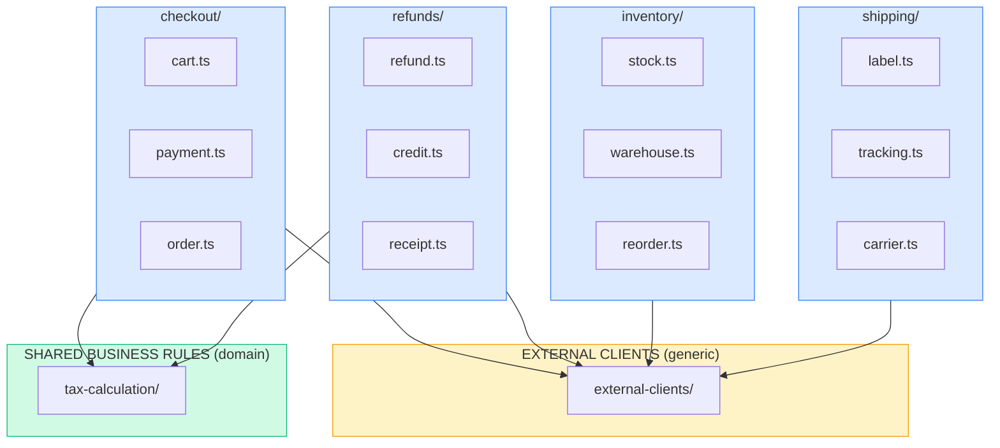

# Separation of Concerns

Separation of concerns makes code:

- **Easier to understand** - each piece has one job
- **Easier to navigate** - know where to look
- **Easier to test** - isolated, focused units
- **Free of duplication** - shared rules in one place
- **Safer to change** - changes don't cascade everywhere

## Four Principles

1. **Separate external clients from domain-specific code**
2. **Separate feature-specific from shared capabilities**
3. **Separate intent from execution**
4. **Separate functions that use different data**

## Mental Model: Verticals and Horizontals



**Vertical** = all code for ONE feature, grouped together
**Horizontal** = shared code used by MULTIPLE features

**For every piece of code, ask:**
- Is this for ONE feature only? → vertical, put it with that feature
- Is this used by MULTIPLE features? → horizontal, name it for what it IS

---

## Principle 1: Separate external clients from domain-specific code

**Ask:** "Would the creators of this external service recognize this code?"
- YES → external-clients/ (horizontal)
- NO → it's your domain code (vertical or domain horizontal)

**external-clients/ contains:**
- Wrappers that expose what each external service can do
- No domain logic
- No project conventions
- Only methods you'd find in that service's official docs

**❌ BAD:**
```
e-commerce/
├── external-clients/
│   └── branch-naming.ts      # ❌ domain convention in external-clients
│
├── checkout/
│   └── git-commands.ts       # ❌ external client code in vertical
```

**✅ GOOD:**
```
e-commerce/
├── external-clients/         # HORIZONTAL - shared by all verticals
│   └── git.ts                # commit, push, pull (generic git operations)
│
├── conventions/              # HORIZONTAL - our rules for using externals
│   └── branch-naming.ts      # parseIssueNumber() - OUR convention
│
├── checkout/                 # VERTICAL
│   └── cart.ts
```

**Check:**
- External client file → everything from their docs? Or mixed with your rules?
- Vertical file → raw external code that should be a client?

---

## Principle 2: Separate feature-specific code from shared capabilities

**Why this matters:**
When two verticals need the SAME business rules, extract to a horizontal. If one vertical updates the rule and the other doesn't → inconsistent behavior, broken product.

**Ask:** "Is this code for ONE feature, or used by MULTIPLE?"
- ONE feature → keep it in that vertical
- MULTIPLE features → extract to horizontal, name it for what it IS (not "shared", "common", "utils")

**Example:** checkout and refunds both calculate tax

**❌ BAD - Business rule buried in one vertical:**
```
e-commerce/
├── checkout/                 # VERTICAL
│   ├── cart.ts
│   └── tax-calculator.ts     # ❌ tax rules aren't checkout-specific
│
└── refunds/                  # VERTICAL
    └── refund.ts             # imports ../checkout/tax-calculator
```

**❌ BAD - Duplicated across verticals:**
```
e-commerce/
├── checkout/
│   └── tax-calculator.ts     # duplicated
│
└── refunds/
    └── tax-calculator.ts     # rules diverge over time
```

**✅ GOOD - Extracted to horizontal:**
```
e-commerce/
├── checkout/                 # VERTICAL
│
├── refunds/                  # VERTICAL
│
└── tax-calculation/          # HORIZONTAL - named for what it IS
    └── tax-calculator.ts
```

**Check:**
- File in vertical → is this rule specific to THIS feature only?
- Vertical importing from another vertical? → extract the shared rule to a horizontal

---

## Principle 3: Separate intent from execution

**Why this matters:**
You should see the high-level flow at one abstraction level. Implementation details of each step belong at a lower level. Navigate from overview to details as needed.

**Example:** A checkout process

**❌ BAD - All abstraction levels mixed:**
```typescript
// Can't see the flow - details of each step obscure it

// Steps:
// 1. validate cart
// 2. process payment
// 3. create order
// 4. send confirmation
async function checkout(cart: Cart) {
  const ctx = new CheckoutContext()
  try {
    const validation = await validateCart(cart)
    if (!validation.success) {
      ctx.errors.push(validation.error)
      throw new ValidationError(validation.error)
    }
    ctx.state = 'validated'

    const payment = await processPayment(cart)
    if (!payment.success) {
      ctx.errors.push(payment.error)
      await rollback(ctx)
      throw new PaymentError(payment.error)
    }
    ctx.state = 'paid'
    // ... 30 more lines for steps 3 and 4
  } catch (e) {
    await cleanup(ctx)
    throw e
  }
}
```

**✅ GOOD - High-level flow visible, drill into details as needed:**
```typescript
function checkout(cart: Cart, paymentDetails: PaymentDetails) {
  const validatedCart = cart.validate()
  const receipt = paymentService.process(validatedCart.total, paymentDetails)
  const order = Order.create(validatedCart, receipt)
  confirmationService.send(order)
  return order
}
```

**Check:**
- Do you need a comment to explain what the code does? → intent is buried
- Can you see the high-level flow without reading every line? → intent is clear

---

## Principle 4: Separate functions that use different data

**Why this matters:**
If methods in a class use different fields, the class is doing multiple jobs. Split it.

**Example:** An OrderProcessor that's actually two things

**❌ BAD - Methods use different fields:**
```typescript
class OrderProcessor {
  private db: Database
  private emailClient: EmailClient
  private templateEngine: TemplateEngine

  // These methods use db
  saveOrder(order: Order) { this.db.insert(order) }
  findOrder(id: string) { return this.db.find(id) }

  // These methods use emailClient + templateEngine
  sendConfirmation(order: Order) {
    const html = this.templateEngine.render('confirmation', order)
    this.emailClient.send(order.customerEmail, html)
  }
  sendShippingUpdate(order: Order) {
    const html = this.templateEngine.render('shipping', order)
    this.emailClient.send(order.customerEmail, html)
  }
}
```

**✅ GOOD - Each class uses all its fields:**
```typescript
class OrderRepository {
  private db: Database

  save(order: Order) { this.db.insert(order) }
  find(id: string) { return this.db.find(id) }
}

class OrderNotifications {
  private emailClient: EmailClient
  private templateEngine: TemplateEngine

  sendConfirmation(order: Order) { /* ... */ }
  sendShippingUpdate(order: Order) { /* ... */ }
}
```

**Check:**
- List the fields. Which methods use which?
- Methods cluster around different fields? → split the class

---

## Quick Reference

| Question | Answer | Action |
|----------|--------|--------|
| Is this for ONE feature only? | Yes | Put in that vertical |
| Is this used by MULTIPLE features? | Yes | Extract to horizontal, name for what it IS |
| Would the external service recognize this? | Yes | external-clients/ |
| Would the external service recognize this? | No | Your domain code |
| Can I see the high-level flow? | No | Separate intent from execution |
| Do methods use different fields? | Yes | Split the class |

---

## Sources

These principles draw from:
- [Vertical Slice Architecture - Jimmy Bogard](https://www.jimmybogard.com/vertical-slice-architecture/)
- [Vertical Slice Architecture (community)](https://verticalslicearchitecture.com/)

**Key insight from Bogard:** "Minimize coupling between slices, maximize coupling within a slice."
